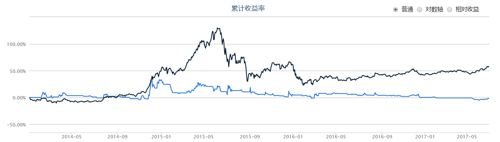
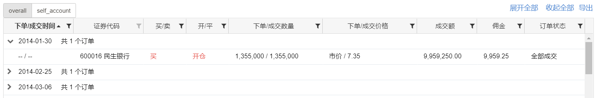
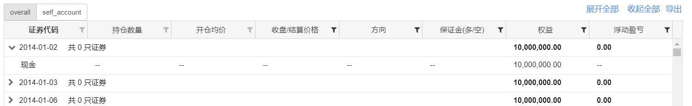
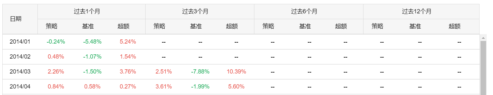
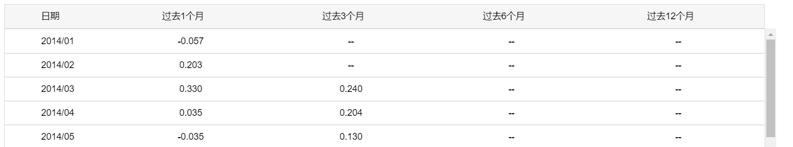
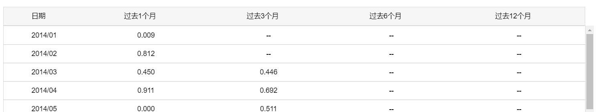
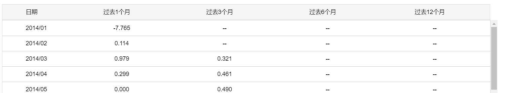
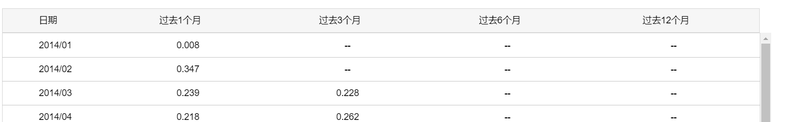
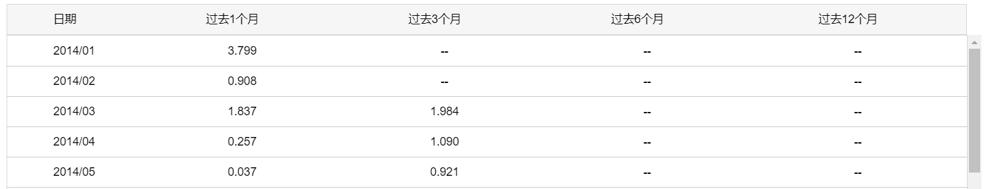
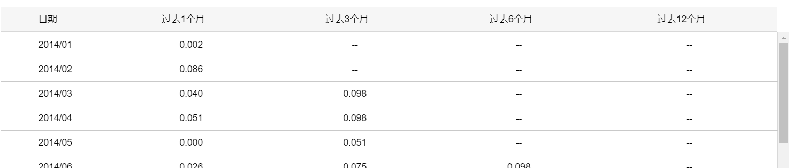

# 回测框架 v 0.1 业务需求

回测框架 v0.1的目的是建立第一个可运行的股票回测工具。

根据开发计划，其应该具备一下功能特征：

- 模仿优矿按日（交易日）执行的框架；
- 使用tushare在线数据，框架不提供数据API接口
- 框架提供回测报告（HTML版本）
- 提供HS300（唯一）基准；
- 资产池，仅支持股票静态资产池；
- 有策略示例程序：
  - 小市值策略；
  - 双均线策略；
  - 配对策略；
- 本版本不考虑：
  - 涨跌停因素；
  - 交易成本（佣金）因素；
  - 滑点因素。

为确保用户体验，再加上以下功能特征：

- 提供CLI访问接口

## 一、策略执行器

## 二、策略结果报告

每次回测都应该形成一份回测报告，目前回测报告以HTML方式生成。

本版本回测报告的内容如下：

- 策略效果参数
- 调仓记录
- 持仓记录
- 收益率 时间线
- 策略主要参数

下面针对各个部分，做一个详细说明：

### 1. 策略效果参数

策略效果基本参数参照以下截图：

其中 收益率 要配以图形，参考如下：

### 2. 调仓记录

按账户列示每个交易日的订单（Order）情况，参考如下图：

其中：

- 要列出证券代码的名称；

- 先不实现 展开/收起 和 导出功能

  

### 3. 持仓记录

按账户列出每个交易日的各资产头寸情况，参考如下图：

其中：

- 含现金资产；

### 4. 收益率 时间线

### 5. 阿尔法 时间线

### 6. β 时间线

### 6. 夏普率 时间线

### 7 收益波动率 时间线

### 8. 信息比率

### 9. 最大回撤

