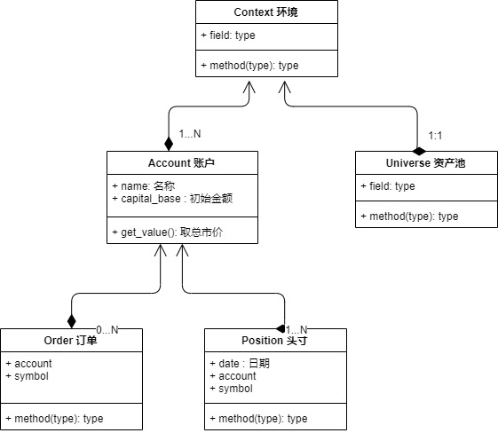
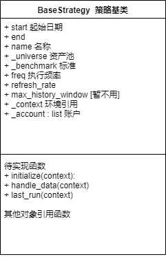
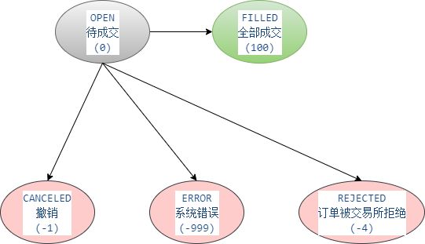

# 回测框架 v 0.1 设计文档

参考《回测框架 v 0.1 业务需求》，本文档是对其的程序实现设计

[TOC]

## 一、回测框架基本说明

### 1. 主要类关系描述

回测框架，主要由以下这几个类或其子类构成，其关系如下图：



**Context 环境类：**

- 负责全局参数获取；
- 负责待执行日期列表的计算；
- 负责缓存数据的准备（后续实现）;
- 负责按日的订单撮合；

**Univrese 资产池：**

- 策略只能从确定的资产池中买卖；
- 资产池目前只有A股静态池；
- 资产池由一个资产编号的列表；

**Account 账户：**

- 策略按账户执行；
- 可允许多个账户同时操作；

**Position 类：**

- 负责某账户某日某资产的头寸数据；
- 交易成功后，会引发头寸改变；

**Order 类：**

- 某账户针对某资产发起的买卖操作订单；
- 订单撮合后，可成交或不成交；（目前版本不支持部分成交）

### 2. 策略执行流程

具体的策略必须是一个继承BaseStrategy类的对象，其长得像：

```python
class MyStrategy(BaseStrategy):

    def __init__(self):
        self.start = '20191104'
        self.end = '20191105'
        self.benchmark = 'HS300'
        self.freq = 'd'
        self.refresh_rate = 1

        # 定义资产池
        self.universe = api.StockUniverse(['600016.SH', '600320.SH'])

        # 定义账户
        self.accounts = {
            'my_account': api.StockAccount('my_account', capital_base=10000)
        }

    def initialize(self, context):
        print('策略初始化')

    def handle_data(self, context):
        print('每周期执行')

    def run_on_finish(self, context):
        print('最后执行')

```

策略的执行，由Runner执行，其处理的流程如下：

1. 初始化Context
2. 调用 MyStrategy.initialize 函数
3. 按周期（通常是交易日）调用 MyStrategy.handle_data 函数
4. 执行订单撮合
5. 调用 MyStrategy.run_on_finish 函数（如有）
6. 汇总策略执行结果，导出结果文件

### 3. 策略回测的执行

框架提供执行器，可针对某个策略实现类进行回测。

框架也提供CLI接口，供用户进行回测操作。

执行foo.MyStrategy策略的CLI接口大致如下：

```python
python backtest run foo.MyStrategy.py
```

### 4. 策略执行结果的输出

每一次策略执行都输出一个单独的文件夹，文件夹名为 StrategyName_yyyyMMdd_HHmmss_序号

输出的文件以html为主，图形为图片。

## 二、程序结构说明

### 模块规则

所有程序存放在 equan.backtest 类包下，主要模块有：

| 模块            | 说明                |
| --------------- | ------------------- |
| backtest_api.py | 回测框架主要类      |
| biz_tools.py    | 业务工具类          |
| data_api.py     | 数据获取API[暂不用] |
| main.py         | 程序主入口(待废弃)  |
| runner.py       | 回测执行器          |
| tl.py           | 工具类              |

### tl.py 工具类说明

tl.py提供两个工具：

1. 日志工具
2. tushare数据访问

**日志工具用法：**

```python
from equan.backtest.tl import log

log.info('这是日志信息')
```

注意：日志配置文件在项目根目录 \config\log.cfg

**tushare数据访问：**

```python
from equan.backtest.tl import tushare

tushare.daily(ts_code='600016.SH', ... )
```

## 三、**BaseStrategy** 类详述

BaseStrategy 是用户策略的基类，所有策略都必须继承BaseStrategy，并实现其中若干的函数。

其大致结构是：



### 1. start 和 end

start和end是策略运行的开始结束日期

### 2. name策略名称

略

### 3. benchmark基准

基准资源池，目前仅支持'HS300'（即沪深300）

### 4. 资产池 Universe

设定一个资产池，策略只能从这个池中交易资产标

更详细内容，参见Universe部分

### 5. 账户 account

TODO 待补充内容

### 6. 策略频率 freq 和 refresh_rate

参数 freq 和 refresh_rate 确定了策略执行的频率。

目前版本只支持每交易日执行一次，即 freq='D' refresh_rate=1；

后续版本中，两者的结合可以有以下若干种方式：

| freq      | refresh_rate | 含义            |
| --------- | ------------ | --------------- |
| 'D'       | 5            | 每5天执行一次   |
| 'M'       | 5            | 每5分钟执行一次 |
| 'Monthly' | [1:]         | 每月第1天       |

其余模式可参考 优矿 架构

## 四、**Context**类详述

## 五、**Universe**类详述

Universe存放的是策略可交易的资产范围，每个策略只有一个资产池。

Universe是一个抽象的类，无法被实例化。其只有一个_symbol_ids属性存放资产id，还有一个 *get_symbols* 函数用于取得特定日期的资产清单，因为考虑到停牌、未上市等因素，具体到某日期资产清单会不一样。

目前版本仅提供"静态股票资产池(StaticStockUniverse)"。StaticStockUniverse可以被实例化使用，目前不考虑诸如股票当日停牌等动态内容（这部分内容在V0.2中考虑），所以其 *get_symbols* 函数返回永远是所有的资产id。

目前版本只使用A股股票，其资产编号规则为（同tushare一致）：

- 沪市股票，如：600016.SH
- 深市股票，如：000016.SZ

## 六、**Account**类详述

Account对象存放账户信息和账户相关的每日头寸、订单等信息。每个策略可以有多个账户。策略对象的 *accounts* 属性是 Account 对象的集合。

每个账户都有一个唯一的名称(name)和初始资金(capital_base)属性。

账户根据交易类型不同有不同的类型(ATYPE)，目前版本只支持股票账户，即类型永远是"STOCK"。

Account类也是一个抽象类，需要使用StockAccount等具体类实例化。

TODO 目前仅有当前时点的Position，无历史Positon存放的地方

### 现金头寸

Account初始化时自动生成一个现金头寸(Position对象)，默认所有的初始资金计入现金头寸中。属性 _cash 中记录现金余额，便于读取。

### 资产头寸

除了现金头寸，每项资产都有当日和历史的头寸列表。

### 下单操作

下单操作( Account.order )是买卖资产的操作，分为按金额下单和按比例下单两种。

下单成功后仅有一个Order对象生成，当时并不对头寸进行处理。只有在撮合时，进行Order的处理，仅有成功的Order才对头寸（Position）进行变动。

有一个特殊函数 close_all_positions 可快速按市场价卖出所有资产，将资产头寸转换为现金头寸。

### 股票下单操作

目前版本只有 StockAccount 的下单操作。其遵循以下规则：

- 按"手"为单位下单，单位不为"手"则直接拒绝；
- 下单的资产id必须在当日的资产池中，否则直接拒绝；
- 下单方式：目前仅支持按市价（收盘价）下单；
- 考虑到tushare取不到的情况，则直接按系统错误终止；
- 取数要从data_api中用接口取数；
- 


## 七、Position类详述

Postion对象记录某项资产（某时刻）的仓位情况。

其主要的属性有：持仓数量、平均开仓成本、当前市值、累计持仓盈亏浮动等。

Postion是Account的一个属性。Account中每种资产都有一个当前Postion列表和历史Postion的字典。

当前Postion列表记录了当前时点所有持有资产的仓位情况。历史Postion字典以时间点为key，即刻时间点的持有资产仓位列表为value。

### *change* 方法

执行仓位变动的操作，变动后持仓数量、平均开仓成本、盈亏浮动等随之计算变动

## 八、Order类详述

Order是记录订单信息的类，可以被实例化。订单的操作在Account和Context中，不在这里操作。

### 订单 状态变化图



### 订单的编号

每个订单都有一个唯一的id编号，在一个Account中是唯一的。

其格式如：2017-01-03-0000001
